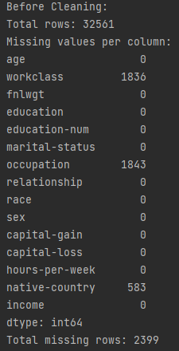
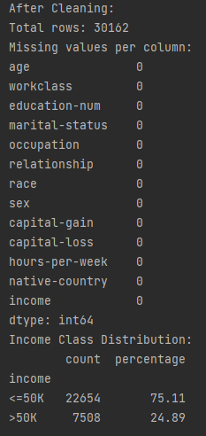
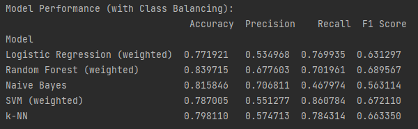
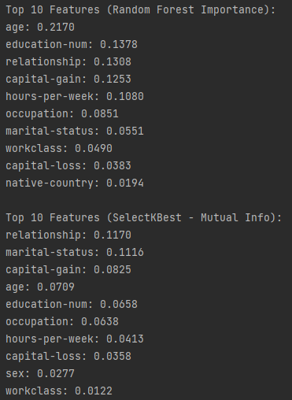
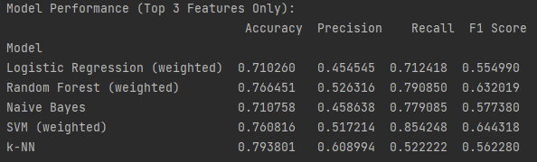

# 🤖 Adult Income Classifier ML

This project builds and evaluates machine learning models to predict whether an individual's income exceeds $50K per year based on the Adult Census Income dataset.

---

## 📊 Project Overview

The goal of this project is to preprocess and analyze census data, handle class imbalance, test multiple classification algorithms, and apply feature selection techniques to create an effective income classification model.

---

## 📁 Files

- **main.py**  
  Loads and preprocesses the dataset, performs exploratory data analysis, and outputs data cleaning summaries.

- **project.py**  
  Contains the core machine learning pipeline: model training, evaluation, and feature selection.

- **requirements.txt**  
  Lists Python dependencies needed to run the project.

---

## ⚙️ Setup & Installation

1. Clone the repository:

   ```bash
   git clone https://github.com/Matthew-J-Lew/adult-income-classifier-ml.git
   cd adult-income-classifier-ml
   ```
2. (Optional but recommended) Create and activate a Python virtual environment:
   ```bash
   python -m venv venv
   source venv/bin/activate   # On Windows use: venv\Scripts\activate
   ```
3. Install the required dependencies:
    ```bash
    pip install -r requirements.txt
    ```
---
## 🚀 Usage
Run the preprocessing and exploratory data analysis:
  ```bash
  python main.py
  ```
Run the model training, evaluation, and feature selection:
  ```bash
  python project.py
  ```
---
## 📈 Results
- The project compares five machine learning models: Logistic Regression, Random Forest, Naive Bayes, Support Vector Machine (SVM), and k-Nearest Neighbors (k-NN).
- Feature selection improves model interpretability with minimal loss in performance.
- The Random Forest classifier achieves the best overall results.
---

## 📸 Screenshots

### 1. Initial Data Overview  
  
*Shows missing value counts and class distribution before data cleaning.*

### 2. Post-Cleaning Data Overview  
  
*Confirms all missing values removed and final row count.*

### 3. Model Performance (With Class Balancing)  
  
*Comparison of all five models trained on the full feature set using SMOTE.*

### 4. Top 10 Features  
  
*Displays the most important features from Random Forest and SelectKBest.*

### 5. Model Performance (Top 3 Features Only)  
  
*Shows how model accuracy changes when trained on a reduced feature set.*

---
## 📄 Report

A detailed report explaining the methodology, experiments, and results can be found [here](docs/report.pdf).

---

## 📜 License
- This project is licensed under the MIT License.
---
## Acknowledgements
- Dataset source: UCI Machine Learning Repository - Adult Data Set
---
Feel free to open issues or submit pull requests!

