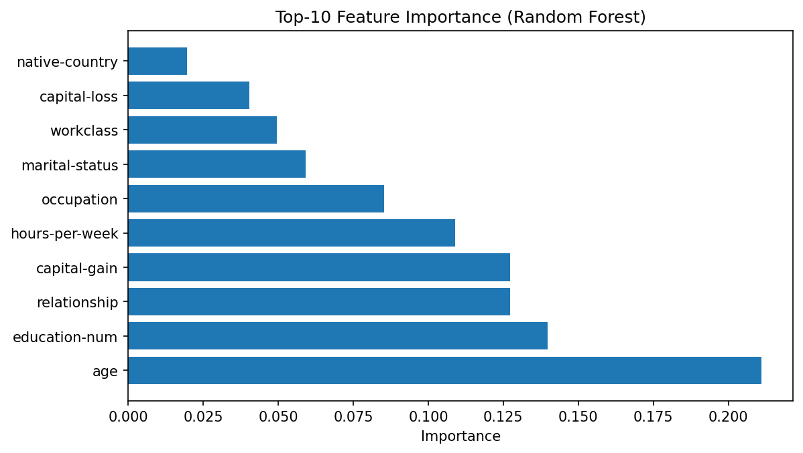

# 🤖 Adult Income Classifier ML

This project builds and evaluates machine learning models to predict whether an individual's income exceeds $50K per year based on the Adult Census Income dataset.

---

## 📊 Project Overview

The goal of this project is to preprocess and analyze census data, handle class imbalance, test multiple classification algorithms, and apply feature selection techniques to create an effective income classification model. The pipeline also generates publication-ready diagrams (PNG + SVG), including ROC curves, confusion matrices, feature importance plots, metrics tables, and class balance visuals.

---

## 📁 Files

- **main.py**  
  Loads and preprocesses the dataset, performs exploratory data analysis, and outputs data cleaning summaries.

- **project.py**  
  Contains the core machine learning pipeline: model training, evaluation, feature selection, and figure generation.

- **requirements.txt**  
  Lists Python dependencies needed to run the project.

- **figures/**  
  Auto-generated folder where all charts/diagrams are saved as `.png` and `.svg`.

---

## ⚙️ Setup & Installation

1. Clone the repository:

   `bash
   git clone https://github.com/Matthew-J-Lew/adult-income-classifier-ml.git
   cd adult-income-classifier-ml
   `

2. (Optional but recommended) Create and activate a Python virtual environment:

   `bash
   python -m venv venv
   source venv/bin/activate   # On Windows use: venv\Scripts\activate
   `

3. Install the required dependencies:

   `bash
   pip install -r requirements.txt
   `

---

## 🚀 Usage

Run the preprocessing and exploratory data analysis:

`bash
python main.py
`

Run the model training, evaluation, and feature selection (this will also generate figures in `./figures`):

`bash
python project.py
`

---

## 📈 Results

- The project compares five machine learning models: **Logistic Regression, Random Forest, Naive Bayes, Support Vector Machine (SVM), and k-Nearest Neighbors (k-NN).**
- Class imbalance is handled with **SMOTE** (Synthetic Minority Oversampling Technique).
- Feature selection improves model interpretability with minimal loss in performance.
- The **Random Forest classifier** achieves the best overall results.

---

## 📸 Screenshots & Visualizations

### Exploratory Data Analysis

1. **Initial Data Overview**  
  
*Shows missing value counts and class distribution before data cleaning.*

2. **Post-Cleaning Data Overview**  
  
*Confirms all missing values removed and final row count.*

---

### Model Training & Evaluation

3. **Class Distribution (Before & After SMOTE)**  
  
*Shows how SMOTE balances the training set compared to the raw dataset.*

4. **Top 10 Feature Importances**  
  
*Highlights which features contribute most to the Random Forest model.*

5. **Confusion Matrices for All Models**  
  
*Side-by-side comparison of predictions vs true labels for each classifier.*

6. **ROC Curves**  
  
*Receiver Operating Characteristic curves showing trade-offs across models.*

7. **Model Performance Table**  
  
*Clean table view of accuracy, precision, recall, and F1 score for all models.*

---

## 📄 Report

A detailed report explaining the methodology, experiments, and results can be found [here](docs/report.pdf).

---

## 📜 License
This project is licensed under the MIT License.

---

## 🙏 Acknowledgements
- Dataset source: [UCI Machine Learning Repository - Adult Data Set](https://archive.ics.uci.edu/ml/datasets/adult)

---

✨ Feel free to open issues or submit pull requests!
